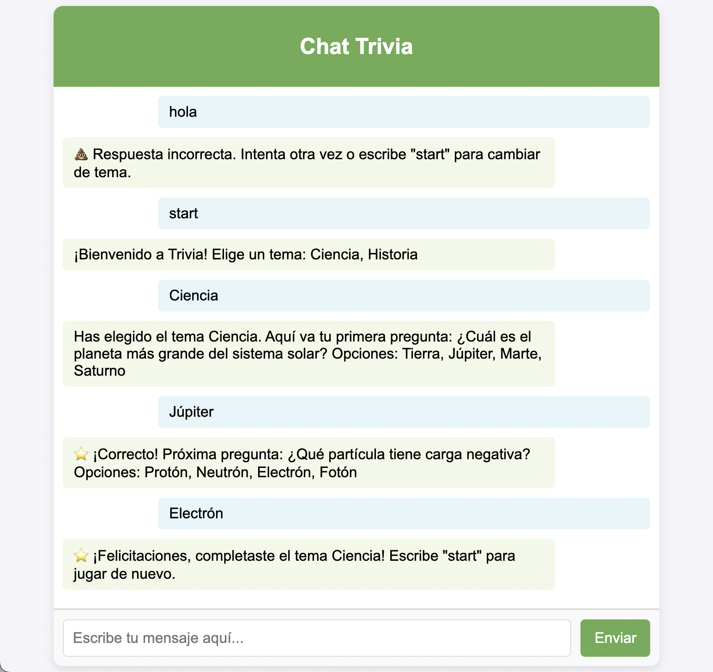
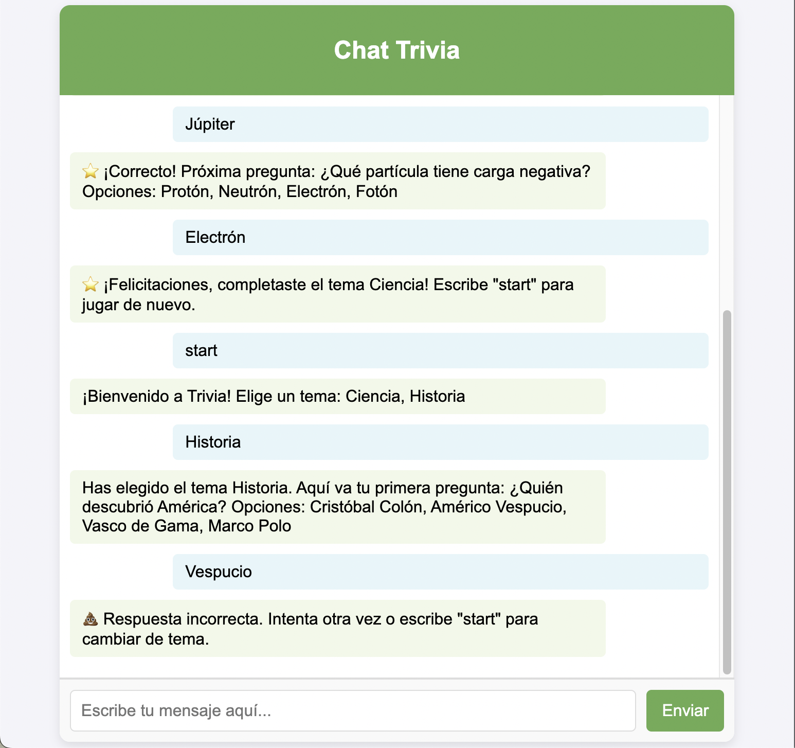

# Trivia

Este proyecto es una demo para crear una trivia básica, vamos a ir agregandole nuevas cosas conforme vamos programando.

### Caracteristicas

Trabaja basado en coincidencia exacta con los textos configurados en un archivo .js. Busca coincidencia y almacena en memoria de una sola instancia las respuestas del cliente.

```javascript
{
  Ciencia: [
    {
      question: "¿Cuál es el planeta más grande del sistema solar?",
      options: ["Tierra", "Júpiter", "Marte", "Saturno"],
      answer: "Júpiter",
    },
    {
      question: "¿Qué partícula tiene carga negativa?",
      options: ["Protón", "Neutrón", "Electrón", "Fotón"],
      answer: "Electrón",
    },
  ],
  Historia: [
    {
      question: "¿Quién descubrió América?",
      options: ["Cristóbal Colón", "Américo Vespucio", "Vasco de Gama", "Marco Polo"],
      answer: "Cristóbal Colón",
    },
    {
      question: "¿En qué año cayó el Imperio Romano?",
      options: ["476", "1492", "1453", "1815"],
      answer: "476",
    },
  ],
}
```

### Capturas

1. Respuestas OK



2. Respuestas NOK


